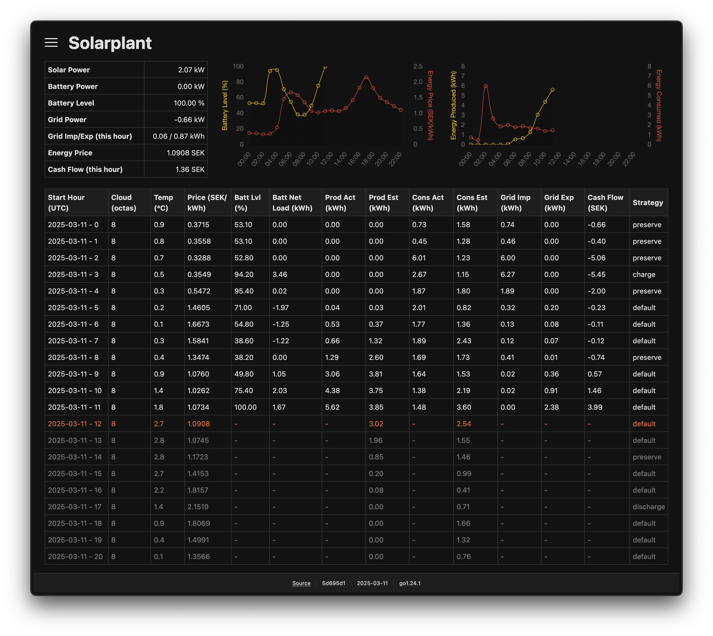

# Solarplant

This application orchestrates battery management in a Ferroamp system by optimizing charging and discharging cycles based on predicted power production and consumption. The system integrates real-time weather forecast data (cloud cover), along with electricity price to maximize cost-effectiveness.



## Getting started

To begin with, you must adapt the [configuration file](config/config.yaml) to your equipment, geo location and electricity contract. The next step is to figure out how to run Solarplant. The easiest way is probably, if you have a spare Linux machine, to download a pre-built binary from [releases](https://github.com/icodeforyou/solarplant-go/releases). Make sure you also include the configuration file along with the binary. This approach will at least let you try the system, but for any other purpose you have to run it as a service or with Docker.

> [!NOTE]  
> Solarplant should be active for a few days in order to gather enough data to make any reliable estimations on production and consumption.

### Run Solarplant with Docker

This assumes that you have the configuration file in a `config/` subdirectory.

```bash
docker run -d \
  --name solarplant \
  -p 8080:8080 \
  -v "$(pwd)/data/:/app/data/" \
  -v "$(pwd)/config/:/app/config/" \
  --restart always \
  ghcr.io/icodeforyou/solarplant-go:latest
```

or if you prefer Docker Compose...

```yaml
services:
  solarplant:
    image: ghcr.io/icodeforyou/solarplant-go:latest
    ports:
      - "8080:8080"
    volumes:
      - ./data/:/app/data/
      - ./config/:/app/config/      
    restart: always
```

### Build from source

1. Download and install the latest [golang](https://go.dev/dl/) release. 
2. Clone this repository `git clone git@github.com:icodeforyou/solarplant-go.git`.
3. Run the provided `build.sh` script and then grab the binary in the `./bin` directory.

### Configuration

By default Solarplant loads the configuration file at location `./config/config.yaml`. This can be overridden by a command line argument like `solarplant --config ./path/to/config.yaml`.

All parameters in the config.yaml file can be set (overridden) via environment variables. They should be provided in capital form with underscores as replacements for hierarchy, for example, `API_ADDRESS`.

## Disclaimer

This software is provided "as is", without warranty of any kind.

## License

This project is licensed under the MIT License - see the [LICENSE](LICENSE.md) file for details.
